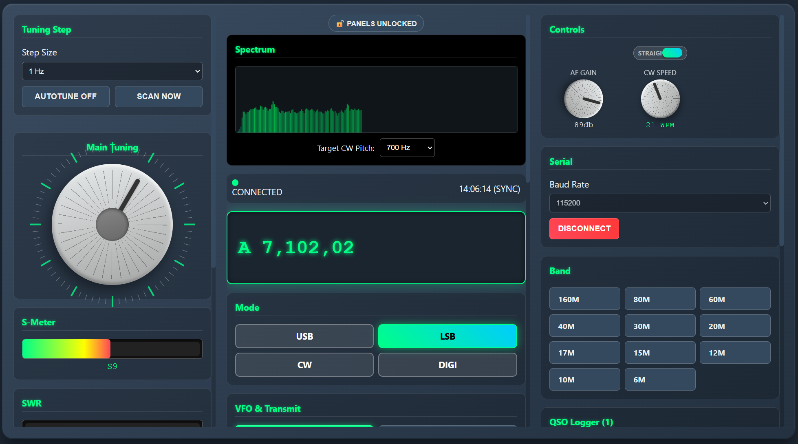
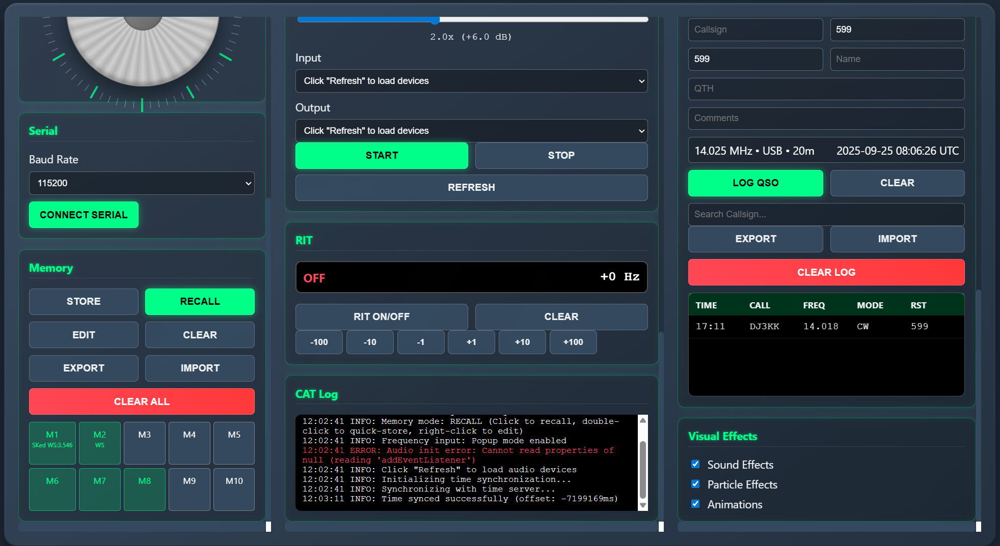

# QMX Interface with new GUI and Spectrum Display


A comprehensive web-based control interface for the QMX QRP transceiver, providing advanced features for amateur radio operators including CAT control, audio streaming, spectrum analysis, and automated tuning capabilities.

## 🌐 Live Demo

**[Try the Live Demo Here](https://sparks72.github.io/QMX-new-GUI/)**
The live demo runs entirely in your browser - no installation required! You can explore the full interface even without a connected radio. For full functionality, connect your QMX transceiver via USB.

### Quick Demo Instructions
1. Click the live demo link above
2. Grant microphone permission for audio features (optional)
3. Explore the interface without hardware
4. Connect your QMX for full CAT control functionality

## Screenshots

**Main Interface Overview**

*The complete QMX+ interface showing the customizable panel layout with frequency display, tuning controls, and AutoTune Spectrum*

**Advanced Features in Action**

*Spectrum analyzer, memory channels, QSO logger, and audio streaming controls in operation*

## Features

### Core Radio Control
- **CAT Control**: Full computer control via WebSerial API
- **Frequency Management**: Precision tuning with multiple input methods
- **Mode Selection**: USB, LSB, CW, and Digital modes
- **Band Switching**: Quick access to all amateur bands (160m-6m including 60m)
- **VFO Control**: Dual VFO operation with A/B switching and copy functions
- **RIT (Receiver Incremental Tuning)**: Fine frequency offset control

### Advanced Features
- **Memory Channels**: 10 programmable memory channels with labels
- **QSO Logger**: Built-in logging with ADIF import/export
- **Audio Streaming**: Real-time audio from radio to PC speakers
- **Spectrum Analyzer**: Visual spectrum display with click-to-tune
- **Autotune**: Automatic signal centering for CW and SSB
- **S-Meter & SWR**: Real-time signal strength and SWR monitoring

### User Interface
- **Draggable Panels**: Customizable layout with lockable panels
- **Multiple Tuning Methods**: 
  - Rotary knob simulation with mouse/touch
  - Keyboard control (arrow keys when hovering over knob)
  - Direct frequency entry (popup or permanent panel)
  - Mouse wheel tuning
- **Variable Step Tuning**: Automatic fast/slow tuning based on speed
- **Professional Styling**: Modern dark theme with realistic controls

## Requirements

### Browser Support
- **Chrome/Chromium 89+** (recommended)
- **Edge 89+**
- **Opera 75+**
- Must support WebSerial API (Firefox not currently supported)

### Hardware Requirements (for full functionality)
- QMX transceiver with CAT interface
- USB-to-serial adapter or built-in USB port
- Computer with USB port
- Optional: Audio interface for streaming features

### Permissions Required
- **Serial Port Access**: For radio communication
- **Microphone Access**: For audio streaming and spectrum analysis (optional)

## Getting Started

### Option 1: Use Live Demo
1. Visit the [Live Demo](https://yourusername.github.io/your-repo-name/)
2. No download or installation required
3. Runs directly in your browser

### Option 2: Download and Run Locally
1. Download `index.html` from this repository
2. Double-click to open in Chrome or Edge
3. Grant permissions when prompted

### Connecting Your Radio
1. Connect your QMX transceiver via USB
2. Click "Connect Serial" in the interface
3. Select your QMX's serial port when prompted
4. Connection status will show "CONNECTED"

## Usage Guide

### Frequency Control
- **Main Tuning Knob**: Click and drag to tune
- **Step Size**: Select tuning step (1 Hz to 10 kHz)
- **Direct Entry**: Click the LCD display for frequency input
- **Keyboard**: Hover over tuning knob and use arrow keys
- **Variable Speed**: Fast tuning automatically increases step size

### Memory Operations
1. **Store**: Select "Store" mode, click memory button
2. **Recall**: Select "Recall" mode, click memory button  
3. **Edit**: Right-click memory button or use Edit mode
4. **Quick Store**: Double-click memory in Recall mode

### QSO Logging
1. Enter callsign and other QSO details
2. Click "Log QSO" to save
3. Export logs in ADIF format
4. Search logged contacts

### Audio Streaming
1. Click "Refresh" to enumerate audio devices
2. Select input device (radio audio)
3. Select output device (speakers/headphones)
4. Click "Start" to begin streaming
5. Adjust gain as needed

### Spectrum Analyzer
1. Start audio streaming first
2. Spectrum display shows real-time audio
3. Click on signals to automatically tune to them
4. Works with autotune for automatic signal centering

## Panel Customization

### Rearranging Panels
1. Panels are unlocked by default (🔓 Panels Unlocked)
2. Drag panels by their title bars to reorganize
3. Move between left, center, and right columns
4. Layout is automatically saved

### Locking Layout
1. Click "🔓 Panels Unlocked" to lock (🔒 Panels Locked)
2. Locked panels cannot be moved
3. Click again to unlock for rearrangement

## Advanced Features

### Autotune Operation
1. Enable "AUTOTUNE ON" in the Step panel
2. Tune near a signal
3. Stop tuning - autotune will center the signal automatically
4. Works for both CW and SSB modes
5. Manual scan available with "SCAN NOW" button

### RIT Control
1. Click "RIT ON/OFF" to enable RIT
2. Use +/- buttons for coarse adjustment  
3. Use RIT knob for fine adjustment
4. "CLEAR" resets offset to zero

### Keyer Control
1. Toggle between STRAIGHT and BUG modes
2. In BUG mode, adjust WPM with knob
3. STRAIGHT mode disables speed control

## Troubleshooting

### Connection Issues
- **"WebSerial not supported"**: Use Chrome/Edge browser
- **No serial ports found**: Check USB connection and drivers
- **Connection fails**: Verify baud rate (115200) and try different port

### Audio Problems
- **No audio devices**: Click "Refresh" and grant microphone permission
- **No audio streaming**: Check audio connections and levels
- **Spectrum not working**: Ensure audio streaming is active first

### Performance Issues
- **Slow response**: Try lower polling rates or reduce panel updates
- **Browser freezing**: Disable spectrum analyzer if not needed
- **Memory usage**: Clear browser cache and restart if needed

## Development

### Local Development
1. Clone this repository
2. Open `index.html` in a supported browser
3. No build process required - pure HTML/CSS/JavaScript

### Contributing
1. Fork the repository
2. Create a feature branch
3. Make your changes
4. Test thoroughly
5. Submit a pull request

### File Structure
```
QMX+ Interface/
├── index.html           # Main application
├── screenshot1.png      # Interface overview
├── screenshot2.png      # Advanced features
├── README.md           # This documentation
└── .github/
    └── workflows/
        └── pages.yml    # GitHub Pages deployment
```

## Technical Details

### CAT Commands
The interface uses standard Kenwood CAT commands:
- `FA`/`FB`: VFO A/B frequency
- `MD`: Mode control
- `IF`: Information request
- `AG`: AF Gain
- `KS`: Keyer speed
- `RT`/`RU`/`RD`: RIT control

### Data Storage
- Panel layouts saved to localStorage
- Memory channels saved to localStorage  
- QSO log saved to localStorage
- Last frequencies per band saved

### Audio Processing
- 48 kHz sample rate
- Real-time spectrum analysis via Web Audio API
- Adjustable gain control
- Peak detection for click-to-tune

## Browser Compatibility

| Browser | Version | WebSerial | Audio API | Status |
|---------|---------|-----------|-----------|--------|
| Chrome | 89+ | ✅ | ✅ | Fully Supported |
| Edge | 89+ | ✅ | ✅ | Fully Supported |
| Opera | 75+ | ✅ | ✅ | Fully Supported |
| Firefox | Any | ❌ | ✅ | Audio Only |
| Safari | Any | ❌ | ✅ | Audio Only |

## Support

For issues, questions, or feature requests:
- Open an issue on this repository
- Check browser console for error messages
- Verify WebSerial API support
- Ensure proper hardware connections

## License

Apache 2.0

---

**73! Enjoy your QMX+ experience!**
